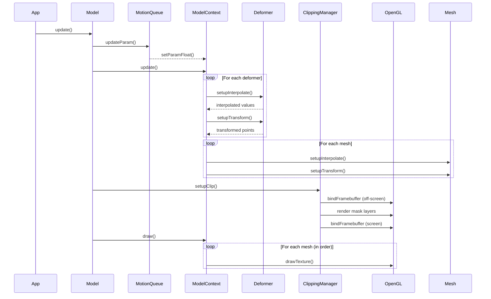

# Live2D v2 渲染系统详细文档

> **注意**: 本文档由 AI (Claude Sonnet) 自动生成，内容基于代码分析编写，可能存在理解偏差，建议结合源代码参考使用。

本文档详细介绍 `package/live2d/v2/core` 中的渲染流程、核心算法和着色器实现。

## 目录

1. [整体架构](#整体架构)
2. [模型加载流程](#模型加载流程)
3. [渲染管线](#渲染管线)
4. [核心算法](#核心算法)
5. [着色器实现](#着色器实现)
6. [剪裁蒙版系统](#剪裁蒙版系统)

---

## 整体架构

Live2D v2 核心渲染系统由以下几个关键模块组成：

```
ALive2DModel (抽象基类)
    └─ Live2DModelOpenGL (OpenGL 具体实现)
        ├─ ModelContext (模型状态管理)
        ├─ DrawParamOpenGL (渲染参数)
        └─ ClippingManagerOpenGL (剪裁管理)

ModelContext 内部:
    ├─ deformerList (变形器列表)
    ├─ drawDataList (绘制数据列表)
    ├─ partsDataList (部件数据列表)
    ├─ paramValues (参数值)
    └─ drawContextList (绘制上下文列表)
```

---

## 模型加载流程

### 1. 二进制文件解析 (.moc)

`BinaryReader` 负责解析 Live2D 二进制格式：

**文件格式结构：**
```
Magic Bytes (3 bytes): 'moc'
Version (1 byte): 版本号
ModelImpl (Object): 模型实现对象
Checksum (2 bytes, v2.8+): 校验和
```

**对象类型编码：**
- `50/51/134/60`: 字符串 ID
- `1`: UTF-8 字符串
- `15`: 数组
- `16`: Int32 数组
- `26`: Float64 数组
- `27`: Float32 数组
- `33`: 对象引用
- `48+`: Live2D 对象

**Live2DObjectFactory** 根据类型码创建对应对象：
- `ModelImpl`: 模型实现
- `PartsData`: 部件数据
- `Mesh`: 网格数据
- `Deformer`: 变形器（旋转/扭曲）
- `ParamPivots`: 参数枢轴

### 2. 模型初始化

`ModelContext.init()` 方法执行初始化：

```python
# 1. 释放旧资源
if len(self.partsDataList) > 0:
    self.release()

# 2. 初始化部件和上下文
for each part in partsDataList:
    self.partsDataList.append(part)
    self.partsContextList.append(part.init())  # 创建部件上下文
    for deformer in part.getDeformer():
        # 处理变形器依赖关系
    for drawData in part.getDrawData():
        self.drawDataList.append(drawData)
        self.drawContextList.append(drawData.init(modelContext))

# 3. 拓扑排序变形器（确保依赖关系正确）
while dependencies exist:
    for each deformer:
        if target is base or resolved:
            add to deformerList
            mark as resolved

# 4. 初始化剪裁管理器
self.clipManager = ClippingManagerOpenGL(drawParamGL)
self.clipManager.init(modelContext, drawDataList, drawContextList)
```

---

## 渲染管线

### 完整渲染流程



### 1. 更新阶段 (`ModelContext.update()`)

**参数更新检测：**
```python
for i in range(len(paramValues)):
    if paramValues[i] != lastParamValues[i]:
        updatedParamFlags[i] = PARAM_UPDATED
        lastParamValues[i] = paramValues[i]
```

**变形器计算：**
```python
for each deformer in deformerList:
    deformer.setupInterpolate(modelContext, context)  # 插值计算
    deformer.setupTransform(modelContext, context)      # 应用变换
```

**网格计算：**
```python
for each mesh in drawDataList:
    mesh.setupInterpolate(modelContext, context)  # 顶点插值
    mesh.setupTransform(modelContext, context)      # 应用变换
```

### 2. 剪裁蒙版预处理 (`ModelContext.preDraw()`)

```python
dp.setupDraw()
clipManager.setupClip(modelContext, dp)
```

`ClippingManager.setupClip()` 执行：
1. 计算所有剪裁区域的边界
2. 将蒙版排列到离屏纹理的不同区域（最多 4 个通道）
3. 切换到离屏帧缓冲区
4. 渲染蒙版层到纹理

### 3. 绘制阶段 (`ModelContext.draw()`)

```python
for each drawOrder in orderList_firstDrawIndex:
    drawIndex = orderList_firstDrawIndex[order]
    while drawIndex != NO_NEXT:
        drawData = drawDataList[drawIndex]
        drawContext = drawContextList[drawIndex]
        if drawContext.isAvailable():
            # 组合透明度
            opacity = (drawData.getOpacity(drawContext) *
                     drawContext.partsOpacity *
                     drawContext.baseOpacity)
            drawData.draw(dp, modelContext, drawContext)
        drawIndex = nextList_drawIndex[drawIndex]
```

---

## 核心算法

### 1. 多维插值算法

Live2D 使用基于枢轴表（Pivot Table）的多维插值算法，支持最多 5 个参数的混合。

#### 1.1 枢轴值计算 (`PivotManager.calcPivotValues()`)

对于每个参数，计算其在枢轴表中的位置和插值因子 t：

```python
for each param in paramPivotTable:
    paramValue = modelContext.getParamFloat(paramIndex)

    if pivotCount == 1:
        if abs(paramValue - pivotValue) < GOSA:
            pivotIndex = 0
            t = 0
        else:
            ret[0] = True  # 参数超出范围
    else:
        # 查找当前值所在的区间
        for j in range(1, pivotCount):
            if paramValue < nextPivotValue + GOSA:
                if nextPivotValue - GOSA < paramValue:
                    pivotIndex = j
                else:
                    pivotIndex = j - 1
                    t = (paramValue - pivotValue) / (nextPivotValue - pivotValue)
                interpolationCount += 1
                break
```

#### 1.2 枢轴索引计算 (`PivotManager.calcPivotIndices()`)

根据每个参数的 pivotIndex 和 t，计算最终的插值索引：

```python
tableSize = 1 << interpolationCount  # 2^n
stride = 1
divisor = 1
tIndex = 0

for each param in paramPivotTable:
    if t == 0:
        # 不插值，直接使用一个索引
        offset = pivotIndex * stride
        for j in range(tableSize):
            indexArray[j] += offset
    else:
        # 需要插值，在两个索引之间切换
        offset1 = stride * pivotIndex
        offset2 = stride * (pivotIndex + 1)
        for j in range(tableSize):
            indexArray[j] += offset1 if (j // divisor) % 2 == 0 else offset2
        tArray[tIndex] = t
        tIndex += 1
        divisor *= 2

    stride *= pivotCount
```

#### 1.3 线性插值 (`UtInterpolate.interpolatePoints()`)

根据插值级别（0-4）使用不同的展开方式：

**0 级插值（无需插值）：**
```python
return pivotPoints[indexArray[0]]
```

**1 级插值（2 个点）：**
```python
t = tArray[0]
p0 = pivotPoints[indexArray[0]]
p1 = pivotPoints[indexArray[1]]
for each vertex:
    result = p0 * (1-t) + p1 * t
```

**2 级插值（4 个点，双线性）：**
```python
t0 = tArray[0]
t1 = tArray[1]
p00 = pivotPoints[indexArray[0]]
p10 = pivotPoints[indexArray[1]]
p01 = pivotPoints[indexArray[2]]
p11 = pivotPoints[indexArray[3]]

for each vertex:
    top = p00 * (1-t0) + p10 * t0
    bottom = p01 * (1-t0) + p11 * t0
    result = top * (1-t1) + bottom * t1
```

**3 级插值（8 个点，三线性）：**
```python
t0, t1, t2 = tArray[0:3]
# 类似 2 级，但多一层
result = (1-t2) * ( (1-t1) * ( (1-t0)*p000 + t0*p100 )
                                + t1 * ( (1-t0)*p001 + t0*p101 ) )
          + t2 * ( (1-t1) * ( (1-t0)*p010 + t0*p110 )
                                + t1 * ( (1-t0)*p011 + t0*p111 ) )
```

**N 级插值（通用情况）：**
```python
tableSize = 1 << n
weights = Float32Array(tableSize)

# 计算 2^n 个插值权重
for i in range(tableSize):
    weight = 1.0
    temp = i
    for j in range(n):
        if temp % 2 == 0:
            weight *= (1 - tArray[j])
        else:
            weight *= tArray[j]
        temp //= 2
    weights[i] = weight

# 加权求和
for each vertex:
    result = sum(weights[i] * pivotPoints[i] for i in range(tableSize))
```

### 2. 旋转变形器算法

#### 2.1 仿射变换插值

仿射变换包含 6 个分量：
- `originX`, `originY`: 变换原点
- `scaleX`, `scaleY`: 缩放因子
- `rotationDeg`: 旋转角度（度）
- `reflectX`, `reflectY`: 反射标志

对于 N 级插值，每个分量独立进行多维插值：

```python
if interpolationLevel <= 0:
    ctx.interpolatedAffine = affines[0]
elif interpolationLevel == 1:
    t = tArray[0]
    a0 = affines[indexArray[0]]
    a1 = affines[indexArray[1]]
    ctx.interpolatedAffine.originX = a0.originX + (a1.originX - a0.originX) * t
    # ... 其他分量类似
```

#### 2.2 矩阵变换应用

将仿射变换转换为 3×3 矩阵并应用到顶点：

```python
def transformPoints(self, srcPoints, dstPoints, numPoint):
    aff = transformedAffine or interpolatedAffine

    # 构造旋转矩阵
    rad = DEG_TO_RAD * aff.rotationDeg
    sinA = sin(rad)
    cosA = cos(rad)

    # 应用缩放和反射
    scaleX = cosA * aff.scaleX * (-1 if aff.reflectX else 1)
    scaleY = -sinA * aff.scaleY * (-1 if aff.reflectY else 1)
    scaleTX = sinA * aff.scaleX * (-1 if aff.reflectX else 1)
    scaleTY = cosA * aff.scaleY * (-1 if aff.reflectY else 1)

    # 变换每个顶点
    for i in range(numPoint):
        x = srcPoints[i*2]
        y = srcPoints[i*2+1]
        dstPoints[i*2] = scaleX * x + scaleY * y + aff.originX
        dstPoints[i*2+1] = scaleTX * x + scaleTY * y + aff.originY
```

### 3. 物理模拟算法

`PhysicsHair` 实现双质点弹簧系统：

```python
def updatePhysics(self, deltaTime):
    # 限制最小时间步长
    if deltaTime < 0.033:
        deltaTime = 0.033

    # 1. 计算点 1 的运动（受输入参数驱动）
    invTime = 1.0 / deltaTime
    p1.vx = (p1.x - p1.lastX) * invTime
    p1.vy = (p1.y - p1.lastY) * invTime
    p1.ax = (p1.vx - p1.lastVX) * invTime
    p1.ay = (p1.vy - p1.lastVY) * invTime

    # 2. 计算受力
    angle = atan2(p2.y - p1.y, p2.x - p1.x)
    gravity = 9.8 * p2.mass
    angleRad = DEG_TO_RAD * self.angle

    # 重力分量
    forceGravity = gravity * cos(angle - angleRad)
    forceX = forceGravity * sin(angle)
    forceY = forceGravity * cos(angle)

    # 阻力（空气阻力）
    forceDragX = -p1.fx * sin(angle) * sin(angle)
    forceDragY = -p1.fy * sin(angle) * cos(angle)

    # 弹簧力
    forceStiffnessX = -p2.vx * stiffness
    forceStiffnessY = -p2.vy * stiffness

    # 3. 应用力到点 2
    p2.fx = forceX + forceDragX + forceStiffnessX
    p2.fy = forceY + forceDragY + forceStiffnessY

    # 4. 更新速度和位置
    p2.vx += p2.ax * deltaTime
    p2.vy += p2.ay * deltaTime
    p2.x += p2.vx * deltaTime
    p2.y += p2.vy * deltaTime

    # 5. 保持固定距离
    currentDistance = sqrt((p2.x - p1.x)^2 + (p2.y - p1.y)^2)
    ratio = self.length / currentDistance
    p2.x = p1.x + (p2.x - p1.x) * ratio
    p2.y = p1.y + (p2.y - p1.y) * ratio
```

---

## 着色器实现

Live2D v2 使用两个着色器程序：
1. **Main Shader** (`shaderProgram`): 用于正常渲染和蒙版渲染
2. **Off-Screen Shader** (`shaderProgramOff`): 用于蒙版混合

### 1. 顶点着色器（Main）

```glsl
attribute vec2 a_position;
attribute vec2 a_texCoord;
varying vec2 v_texCoord;
varying vec4 v_clipPos;
uniform mat4 u_mvpMatrix;

void main() {
    gl_Position = u_mvpMatrix * vec4(a_position, 0.0, 1.0);
    v_clipPos = gl_Position;
    v_texCoord = a_texCoord;
    v_texCoord.y = 1.0 - v_texCoord.y;  // 翻转 Y 轴
}
```

**功能：**
- 应用 MVP 矩阵变换顶点
- 传递裁剪空间位置（用于蒙版检测）
- 传递 UV 坐标并翻转 Y 轴

### 2. 片段着色器（Main）

```glsl
precision mediump float;

varying vec2 v_texCoord;
varying vec4 v_clipPos;

uniform sampler2D s_texture0;
uniform vec4 u_channelFlag;
uniform vec4 u_baseColor;
uniform bool u_maskFlag;
uniform vec4 u_screenColor;
uniform vec4 u_multiplyColor;

void main() {
    vec4 smpColor;

    if (u_maskFlag) {
        // 蒙版渲染模式
        float isInside =
            step(u_baseColor.x, v_clipPos.x / v_clipPos.w) *
            step(u_baseColor.y, v_clipPos.y / v_clipPos.w) *
            step(v_clipPos.x / v_clipPos.w, u_baseColor.z) *
            step(v_clipPos.y / v_clipPos.w, u_baseColor.w);

        smpColor = u_channelFlag *
                   texture2D(s_texture0, v_texCoord).a *
                   isInside;
    } else {
        // 正常渲染模式
        smpColor = texture2D(s_texture0, v_texCoord);
        smpColor.rgb = smpColor.rgb * smpColor.a;  // 预乘 Alpha
        smpColor.rgb = smpColor.rgb * u_multiplyColor.rgb;  // 乘法混合
        smpColor.rgb = smpColor.rgb + u_screenColor.rgb -
                       (smpColor.rgb * u_screenColor.rgb);  // 屏幕混合
        smpColor = smpColor * u_baseColor;
    }

    gl_FragColor = smpColor;
}
```

**颜色混合公式：**
- 预乘 Alpha：`rgb *= a`
- 乘法混合：`rgb = rgb * multiplyColor`
- 屏幕混合：`rgb = rgb + screen - (rgb * screen)`（相当于 `rgb + (1-rgb)*screen`）

### 3. 顶点着色器（Off-Screen）

```glsl
attribute vec2 a_position;
attribute vec2 a_texCoord;
varying vec2 v_texCoord;
varying vec4 v_clipPos;

uniform mat4 u_mvpMatrix;
uniform mat4 u_clipMatrix;

void main() {
    vec4 pos = vec4(a_position, 0, 1.0);
    gl_Position = u_mvpMatrix * pos;
    v_clipPos = u_clipMatrix * pos;  // 使用不同的裁剪矩阵
    v_texCoord = a_texCoord;
    v_texCoord.y = 1.0 - v_texCoord.y;
}
```

### 4. 片段着色器（Off-Screen）

```glsl
precision mediump float;

varying vec2 v_texCoord;
varying vec4 v_clipPos;

uniform sampler2D s_texture0;   // 模型纹理
uniform sampler2D s_texture1;   // 蒙版纹理
uniform vec4 u_channelFlag;      // 通道选择
uniform vec4 u_baseColor;
uniform vec4 u_screenColor;
uniform vec4 u_multiplyColor;

void main() {
    // 采样模型颜色
    vec4 col_formask = texture2D(s_texture0, v_texCoord);
    col_formask.rgb = col_formask.rgb * col_formask.a;
    col_formask.rgb = col_formask.rgb * u_multiplyColor.rgb;
    col_formask.rgb = col_formask.rgb + u_screenColor.rgb -
                       (col_formask.rgb * u_screenColor.rgb);
    col_formask = col_formask * u_baseColor;

    // 采样蒙版
    vec4 clipMask = texture2D(s_texture1, v_clipPos.xy / v_clipPos.w) *
                    u_channelFlag;

    // 应用蒙版（RGBA 通道求和）
    float maskVal = clipMask.r + clipMask.g + clipMask.b + clipMask.a;

    col_formask = col_formask * maskVal;

    gl_FragColor = col_formask;
}
```

### 5. 混合模式配置

根据颜色合成类型配置混合函数：

| 类型 | 源 RGB | 源 Alpha | 目标 RGB | 目标 Alpha | 描述 |
|------|---------|-----------|-----------|------------|------|
| Normal | ONE | ONE_MINUS_SRC_ALPHA | ONE | ONE_MINUS_SRC_ALPHA | 标准 Alpha 混合 |
| Screen | ONE | ONE | ZERO | ONE | 屏幕混合（亮化） |
| Multiply | DST_COLOR | ONE_MINUS_SRC_ALPHA | ZERO | ONE | 正片叠底（暗化） |
| Mask | ONE | ONE_MINUS_SRC_ALPHA | ONE | ONE_MINUS_SRC_ALPHA | 蒙版绘制 |

```python
if comp == COLOR_COMPOSITION_NORMAL:
    blendFunc(ONE, ONE_MINUS_SRC_ALPHA, ONE, ONE_MINUS_SRC_ALPHA)
elif comp == COLOR_COMPOSITION_SCREEN:
    blendFunc(ONE, ONE, ZERO, ONE)
elif comp == COLOR_COMPOSITION_MULTIPLY:
    blendFunc(DST_COLOR, ONE_MINUS_SRC_ALPHA, ZERO, ONE)
```

---

## 剪裁蒙版系统

### 1. 蒙版布局策略

将多个剪裁区域排列到单个纹理的不同通道和区域：

```
纹理布局 (默认 256x256):

┌─────────┬─────────┐
│ Channel 0 │ Channel 1 │  (1-2 个蒙版)
├─────────┼─────────┤
│ Channel 2 │ Channel 3 │  (3-4 个蒙版)
└─────────┴─────────┘

当蒙版数量更多时，每个通道再细分：

3-4 个蒙版:
┌──────┬──────┐
│  0   │  1   │
├──────┼──────┤
│  2   │  3   │
└──────┴──────┘

5-9 个蒙版 (3x3):
┌───┬───┬───┐
│ 0 │ 1 │ 2 │
├───┼───┼───┤
│ 3 │ 4 │ 5 │
├───┼───┼───┤
│ 6 │ 7 │ 8 │
└───┴───┴───┘
```

### 2. 蒙版渲染流程

```python
def setupClip(self, modelContext, drawParam):
    # 1. 计算每个剪裁组的边界
    for each clipContext in clipContextList:
        calcClippedDrawTotalBounds(modelContext, clipContext)

    # 2. 绑定离屏帧缓冲区
    oldFbo = glGetIntegerv(FRAMEBUFFER_BINDING)
    glBindFramebuffer(FRAMEBUFFER, framebufferObject)

    # 3. 设置蒙版纹理视口
    viewport(0, 0, CLIPPING_MASK_SIZE, CLIPPING_MASK_SIZE)

    # 4. 清除蒙版纹理
    clearColor(0, 0, 0, 0)
    clear(COLOR_BUFFER_BIT)

    # 5. 布局蒙版区域
    setupLayoutBounds(numActiveClips)

    # 6. 渲染每个剪裁组
    for each clipContext in clipContextList:
        # 计算从模型空间到蒙版空间的矩阵
        matrixForMask = createMaskMatrix(clipContext.allClippedDrawRect)
        matrixForDraw = createDrawMatrix(clipContext.layoutBounds)

        # 渲染剪裁形状到蒙版纹理
        for each maskMesh in clipContext.clippingMaskDrawIndexList:
            drawMaskMesh(matrixForMask, clipContext.layoutChannelNo)

    # 7. 恢复主帧缓冲区
    glBindFramebuffer(FRAMEBUFFER, oldFbo)
    viewport(0, 0, screenWidth, screenHeight)
```

### 3. 蒙版检测着色器逻辑

使用 `step()` 函数进行精确的边界检测：

```glsl
float isInside =
    step(u_baseColor.x, v_clipPos.x / v_clipPos.w) *  // x >= left
    step(u_baseColor.y, v_clipPos.y / v_clipPos.w) *  // y >= top
    step(v_clipPos.x / v_clipPos.w, u_baseColor.z) *  // x <= right
    step(v_clipPos.y / v_clipPos.w, u_baseColor.w);   // y <= bottom
```

其中 `u_baseColor` 包含 `(left, top, right, bottom)` 边界。

### 4. 通道标志编码

```python
channelColors = [
    TextureInfo(r=0, g=0, b=0, a=1),  # Alpha 通道
    TextureInfo(r=1, g=0, b=0, a=0),  # Red 通道
    TextureInfo(r=0, g=1, b=0, a=0),  # Green 通道
    TextureInfo(r=0, g=0, b=1, a=0),  # Blue 通道
]
```

在着色器中：
```glsl
vec4 clipMask = texture2D(s_texture1, v_clipPos.xy / v_clipPos.w) * u_channelFlag;
float maskVal = clipMask.r + clipMask.g + clipMask.b + clipMask.a;
```

只有对应通道有值的像素才会显示被剪裁的内容。

---

## 性能优化建议

1. **减少不必要的更新**：使用 `checkParamUpdated()` 跳过未变化的变形器计算

2. **VBO 缓存复用**：使用 `bindOrCreateVBO()` 重用顶点缓冲区对象

3. **批次绘制**：尽可能合并相同纹理的绘制调用

4. **剪裁合并**：多个相同的剪裁组会被 `findSameClip()` 合并

5. **精度控制**：在不需要高精度的设备上禁用 `precision mediump float`

---

## 相关文件索引

| 模块 | 文件路径 |
|------|---------|
| 模型上下文 | `core/model_context.py` |
| 模型实现 | `core/alive2d_model.py` |
| 二进制读取 | `core/io/binary_reader.py` |
| 网格绘制 | `core/draw/mesh.py` |
| 变形器 | `core/deformer/deformer.py` |
| 旋转变形器 | `core/deformer/roation_deformer.py` |
| 扭曲变形器 | `core/deformer/warp_deformer.py` |
| 插值算法 | `core/util/ut_interpolate.py` |
| 枢轴管理 | `core/param/pivot_manager.py` |
| 渲染参数 | `core/graphics/draw_param_opengl.py` |
| 剪裁管理 | `core/graphics/clipping_manager_opengl.py` |
| 物理模拟 | `core/physics/physics_hair.py` |
| 运动系统 | `core/motion/live2d_motion.py` |
| 运动队列 | `core/motion/motion_queue_manager.py` |
